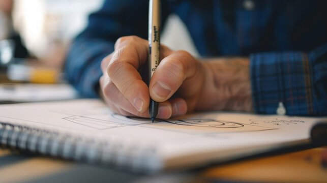

[← Volver al inicio](README.md)
# Temas del curso

### 18/9 Mis Aficiones

Desde temprana edad mi afición más marcada ha sido el arte, el dibujo tradicional en especial.
Durante mi vida fui a cantidad de clases de dibujo 
pero actualmente aprendo por mi cuenta y estoy probando técnicas nuevas como dibujo digital 
o técnicas basicas de animación.

