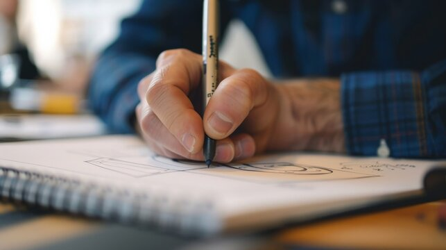

[← Volver al inicio](README.md)
# Temas del curso

### 18/9 Mis Aficiones

Desde temprana edad mi afición más marcada ha sido el arte, el dibujo tradicional en especial.
Durante mi vida fui a cantidad de clases de dibujo 
pero actualmente aprendo por mi cuenta y estoy probando técnicas nuevas como dibujo digital 
o técnicas basicas de animación.

[He investigado por internet y he econtrado esta web acerca de arte digital](https://www.aseprite.org/)

### 01/10 · Premios Princesa de Asturias: Studio Ghibli

Studio Ghibli es un estudio de animación filial de "Nippon Television Holdlings". En este 2026, el estudio fue premiado en la categoría de Comunicación y Humanidades
gracias a su excelente narración y cuidado de la cultura, además de su gran creatividad y estilo de animación característico. En concreto, escogí este premiado por mi fanatismo hacia el estudio
y sus metrajes, además que soy un fanático de la cultura de la animación y del arte.
[Esta es su página en la fundación](https://www.fpa.es/es/premios-princesa-de-asturias/premiados/2026-studio-ghibli/)

